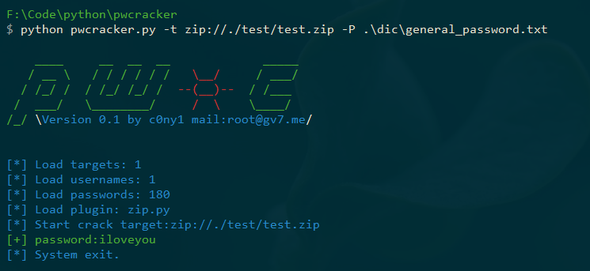

# pwcracker：一款插件化密码爆破框架

[](https://github.com/c0ny1/pwcracker) [](https://www.python.org/) [](https://raw.githubusercontent.com/Xyntax/POC-T/master/doc/LICENSE.txt) 
[](https://github.com/Xyntax/POC-T/wiki/%E5%86%85%E7%BD%AE%E8%84%9A%E6%9C%AC%E5%BA%93) 

密码破解脚本调用框架，目前支持密文，文件，服务和应用等类型的20种密码破解。



## 一、简介
该项目主要解决以下问题

|问题|解决|
|:--|:--|
|一些自定义算法，不常用的文件，冷门的服务如何爆破？|支持自定义插件编写|
|python的爆破脚本很多，特别零散，如何把它们集合到一起？|将其核心爆破功能编写成插件，由框架统一调用|
|编译型的爆破工具，在爆破过程中莫名失败，如何调试？|可以临时修改脚本输出调式|

目前工具的优势和缺陷，请各位根据其特点。自行选择在那种场景下使用。

|优点|缺陷|
|:--|:--|
|支持多种类型的爆破，比如密文，文件，服务和应用等|速度相对比较慢：于hydra等工具相比|
|支持通用算法，也可以自定义算法|部分插件的环境有点难配置：有些插件用的python包比较难安装，容易报错|
|支持多种爆破模式多账号多密码，单账号多密码，多账号单密||  
|支持单个目标，也可以批量||  


## 二、快速使用

#### 2.1 安装

```
git clone https://github.com/c0ny1/pwcracker
pip install -r requirement.txt
python pwcracker.py
```

#### 2.2 参数列表

```
$ python pwcracker.py -h
usage: pwcracker.py [options]

* An expandable password cracking framework. *
By c0ny1 (http://gv7.me)

optional arguments:
  -h, --help            show this help message and exit

CRACK:
  -t TARGET             The target to crack,target format:protocol://path:port
  -T FILE               Load the target file to be cracked.
  -u USERNAME, --username USERNAME
                        The user name to crack.
  -U FILE               The user name dictionary file to load.
  -p PASSWORD, --password PASSWORD
                        Passwords to crack.
  -P FILE               Load the password dictionary file to be cracked.
  -r THREADS            Num of scan threads for each scan process, 3 by default

SHOW:
  -s, --show            Show all plugins
  -i PLUGIN_NAME, --info PLUGIN_NAME
                        Show one plugins
  -v                    Show the details of the cracking password.
  -V, --version         show program's version number and exit

```

#### 2.3 Example：

(1)爆破md5

```
python pwcracker.py -t md5:// -P D://password.txt
```

(2)爆破zip文件

```
python pwcracker.py -t zip://d://test.zip -U D://username.txt -P D://password.txt
```

(3)爆破telnet

```
python pwcracker.py -t telnet://192.168.1.108:23 -U D://username.txt -P D://password.txt
```

## 三、插件列表

|序号|插件|描述|
|:---:|:---|:---|
|1|md2|用于爆破md2算法的密文|
|2|md4|用于爆破md4算法的密文|
|3|md5|用于爆破md5算法的密文|
|4|sha1|用于爆破sha1算法的密文|
|5|sha224|用于爆破sha224算法的密文|
|6|sha256|用于爆破sha256算法的密文|
|7|sha384|用于爆破sha384算法的密文|
|8|sha512|用于爆破sha512算法的密文|
|9|ftp|用于爆破ftp服务的账户密码|
|10|ssh|用于爆破ssh服务的账户密码|
|11|telnet|用于爆破telnet服务的账户密码|
|12|mysql|用于爆破mysql数据库的账户密码|
|13|oracle|用于爆破oracle数据库的账户密码|
|14|oracle_sid|用于爆破oracle数据库的sid|
|15|mssql|用于爆破mssql数据库的账户密码|
|16|vnc|用于爆破vnc服务的账户密码|
|17|7z|用于爆破7z文件的密码|
|18|rar|用于爆破rar文件的密码|
|19|zip|用于爆破zip文件的密码|
|20|pdf|用于爆破pdf文件的密码|


## 四、插件编写

#### 4.1 插件模板：


```
#coding=utf-8

def plu_info():
	dict_plugin={};
	dict_plugin['name']="md5" # 插件名称
	dict_plugin['author']="c0ny1<root@gv7.me>" # 作者
	dict_plugin['date'] = "2018-09-24 18:23" # 最后更新时间
	dict_plugin['description'] = "Used to crack MD5 ciphertext." # 描述
	dict_plugin["usage"] = "python pwcracker.py -t test://127.0.0.1 -u root -p root" # 使用例子
	return dict_plugin

def doCheck(address,username_list,password_list):
	pass

def doCracker(address,username,password):
	pass
```

#### 4.2 说明
1. plu_info（）函数用于返回插件的一些信息，当执行`python pwcracker.py --info plugin_name`,会在控制台显示插件的信息。


2. doCheck(address,username_list,password_list)函数是在爆破前对爆破的目标，字典列表，密码列表进行检查。如果检查合格则返回True,就可以进行爆破了。若果检查是存在问题，则返回False，框架就会终止运行并提示不合法的数据位置。


3. doCrack(address,username,password)函数是必须要实现的。传入的参数分别是爆破的目标，用户名和密码。我们需要在函数体内实现爆破的核心功能。爆破成功，则`return True,msg`,失败则`return False,msg`。这里msg是成功或者失败附带的信息，没有的话可以设置为None。


注意:

>1. plu_info()和doCheck(address,username_list,password_list)为可选实现，doCrack(address,username,password)必须实现！
>2. 具体例子可以参数项目plus下的插件。

#### 4.3 API

框架提供的API

|api|描述|
|:--|:--|
|getPath(address)|从目标address中分析出路径，或者主机等目标主体等信息|
|getPort(address)|从目标address中分析出port|
|getParam(address)|从目标address中分析出携带的参数|
|isIP(ip)|判断是否是合法的ip|
|isPort(port)|判断是否是合法的port，即范围为大于等于0，小于等于65535|
|checkIP|检查ip是否存活|
|checkPort|检查端口是否开放|


## 五、参考项目

* [POC-T](https://github.com/Xyntax/POC-T)
* [patator](https://github.com/lanjelot/patator)